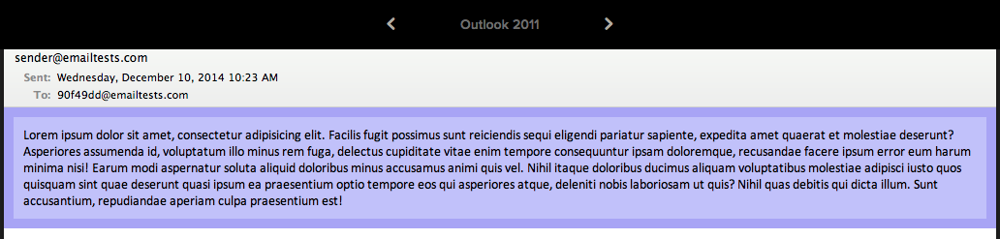
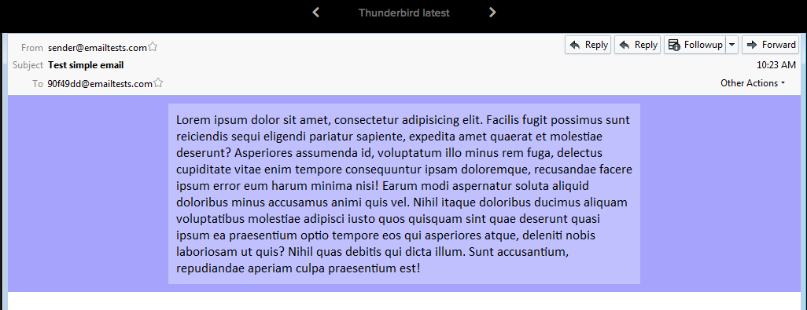
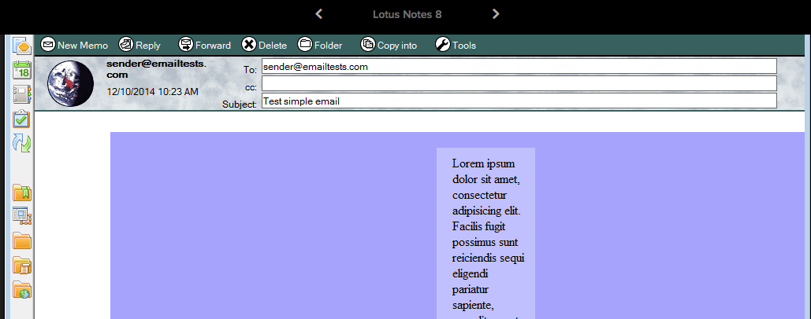
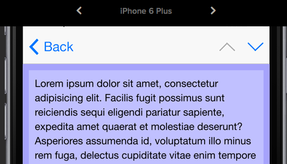

# Responsive email template.
## The objective
Here I will make a responive HTML email template. It will have two columns which condense down to one column on smaller screens.
```
_________________                   _________
| Header        |                   |Header |
|_______________|           |\      |_______|
|Column1|Column2|   --------| \     |Column1|
|       |       |   --------| /     |       |
|       |       |           |/      |       |
|_______|_______|                   |_______|
|Footer         |                   |Column2|
|_______________|                   |       |
                                    |       |
                                    |_______|
                                    |Footer |
                                    |_______|
```

It will work on almost all the email clients I can test with Litmus (https://litmus.com), including all versions of Outlook and Gmail. The only clients causing problems are old versions of Lotus notes, but it will still be readable.

I will also test the email directly in the following clients:

- Web
  - Gmail on Chrome
  - Yahoomail on Chrome
  - Outlook on Chrome
- Desktop
  - Apple Mail
- Mobile
  - Gmail app for Android
  - Android Mail

## Cerberus
http://tedgoas.github.io/Cerberus/

Looking on the web for something that will do this. I find Cerberus

At first glance, Cerberus appears to be exactly what we want, but on closer inspection we can see that it is not. Their first template does exactly what we want, but only in clients that support media queries, so not gmail. Their second template does work on gmail, but doesn't exhibit the desired behaiour of two columns condensing down to one.

Gmail is a client we simply can't ignore. Litmus ranks it as #2 in the world (http://emailclientmarketshare.com/). So I will have to find my own solution. However I did take a few styling ideas from Cerberus to help fix known problems

## A Basic Email

So, lets try a basic, responsive email. No columns or funny business to start.

```html
<!DOCTYPE html PUBLIC "-//W3C//DTD XHTML 1.0 Strict//EN" "http://www.w3.org/TR/xhtml1/DTD/xhtml1-strict.dtd">
<html xmlns="http://www.w3.org/1999/xhtml">
<head>
  <meta http-equiv="Content-Type" content="text/html; charset=utf-8" />
  <meta name="viewport" content="width=device-width, initial-scale=1.0"/>
  <title>Responsive Email</title>
</head>
<body style="margin: 0; padding: 0; width:100%; height:100%;">
  <table class="email_body" width="100%" cellspacing="0" cellpadding="10" border="0" bgcolor="#A6A3FC">
    <tr>
      <td align="center">
        <table class="wrapper" style="max-width:600px;" cellspacing="0" cellpadding="10" border="0" bgcolor="#C0C0FF">
          <tr>
            <td>
              Lorem ipsum dolor sit amet, consectetur adipisicing elit. Facilis fugit possimus sunt reiciendis sequi eligendi pariatur sapiente, expedita amet quaerat et molestiae deserunt? Asperiores assumenda id, voluptatum illo minus rem fuga, delectus cupiditate vitae enim tempore consequuntur ipsam doloremque, recusandae facere ipsum error eum harum minima nisi! Earum modi aspernatur soluta aliquid doloribus minus accusamus animi quis vel. Nihil itaque doloribus ducimus aliquam voluptatibus molestiae adipisci iusto quos quisquam sint quae deserunt quasi ipsum ea praesentium optio tempore eos qui asperiores atque, deleniti nobis laboriosam ut quis? Nihil quas debitis qui dicta illum. Sunt accusantium, repudiandae aperiam culpa praesentium est!
            </td>
          </tr>
        </table>
      </td>
    </tr>
  </table>
</body>
</html>
```

We use the strict XHTML doctype as this is what your email client is likely to be using. The head is what you would expect for a responsive page, although many clients will discard this too.

So we have an `email_body` table, which will fill the available width of the email. It's contents are aligned `center` to center the email `wrapper` in the email window.
And we have a `wrapper` table, set to a max-width of 600px.
Both tables have a `cellpadding` of 10px, and background colours to help us see what is going on.

Lets see what Litmus makes of this.

Firstly we can see that most of the desktop clients are ignoring our min-width


Thunderbird is the only one to get it right.


As for Lotus notes 8...

Well lets just not go there...

Secondly we can see the treatment of the text alignment is inconsistent. Some Clients, such as older versions of outlook, some web based clients running on internet explorer, and Windows Phone are centering the text of the `wrapper` table, rather than just centering the `wrapper` table in the `email_body`. Fortunately this is an easy fix, just add `align="left"` to the `wrapper` table
")

On the bright side. All the mobiles and tablets are working pretty much how we would like them too.


##Max-width work around

In Apple Mail, it turns out that it allows max-width on block level elements, but not on table elements. So a quick fix is to add the style `display:block` to our table. This also fixes Outlook 2011 on mac, because this version of Outlook, like Apple Mail, uses WebKit, and is therefor farely sensible. (It also turns out that this cures Lotus Notes 8 of it's crazyness as well, although it doesn't fix the max-width problem.)

But what about the rest of Outlook and Lotus Notes? Thankfully microsoft have been very helpful, and given us some conditional code that only they will render. It looks like this:

```
<!--[if (gte mso 9)|(IE)]>
  ...code...
<![endif]-->
```
`mso 9` targets Microsoft Office 2000, `gte` means greater than or equal to. So this will match version 2000 and later. `IE` targets internet explorer versions 5-9.

What can we do with this code? Since the clients this matches are always desktop based, we can dispense with the responsiveness and code in the width of the table to 600px. I've given it a nice colour so we can see where it is being used.

```html
<table class="wrapper" style="max-width:620px; display:block" cellspacing="0" cellpadding="10" border="0" bgcolor="#C0C0FF">
  <tr>
    <td align="left">
      <!-- Outlook and Lotus Notes don't support max-width but are always on desktop, so we can enforce a wide, fixed width view. -->
      <!--[if (gte mso 9)|(IE)]>
      <table width="600" cellpadding="0" cellspacing="0" border="0" bgcolor="#FFF3CO">
        <tr>
          <td width="600">
      <![endif]-->

      Lorem ipsum dolor sit amet, consectetur adipisicing elit. Facilis fugit possimus sunt reiciendis sequi eligendi pariatur sapiente, expedita amet quaerat et molestiae deserunt? Asperiores assumenda id, voluptatum illo minus rem fuga, delectus cupiditate vitae enim tempore consequuntur ipsam doloremque, recusandae facere ipsum error eum harum minima nisi! Earum modi aspernatur soluta aliquid doloribus minus accusamus animi quis vel. Nihil itaque doloribus ducimus aliquam voluptatibus molestiae adipisci iusto quos quisquam sint quae deserunt quasi ipsum ea praesentium optio tempore eos qui asperiores atque, deleniti nobis laboriosam ut quis? Nihil quas debitis qui dicta illum. Sunt accusantium, repudiandae aperiam culpa praesentium est!
    
      <!-- End of Outlook-specific wrapper -->
      <!--[if (gte mso 9)|(IE)]>
          </td>
        </tr>
      </table>
      <![endif]-->
    </td>
  </tr>
</table>
```

This fixes Lotus Noes 8 - 8.5, and all the Outlooks.


It has no effect on any clients we don't want it to, including Outlook 2011 for mac, which is using the WebKit to render the email.


(So we haven't fixed Lotus Notes 6.5 or 7. I view them in the same way I view ie6: obsolete and not worth my time, as long as its still possible for them to read the email, I don't care how horrible it looks.)

