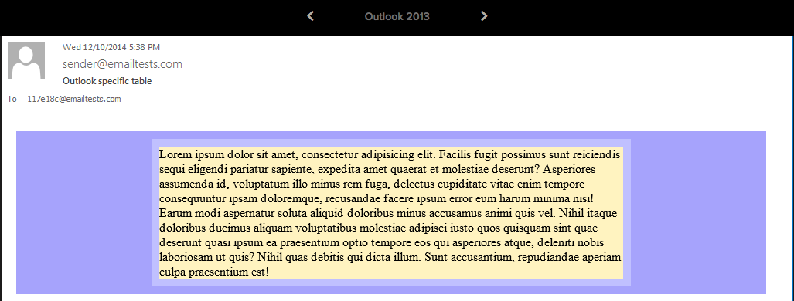
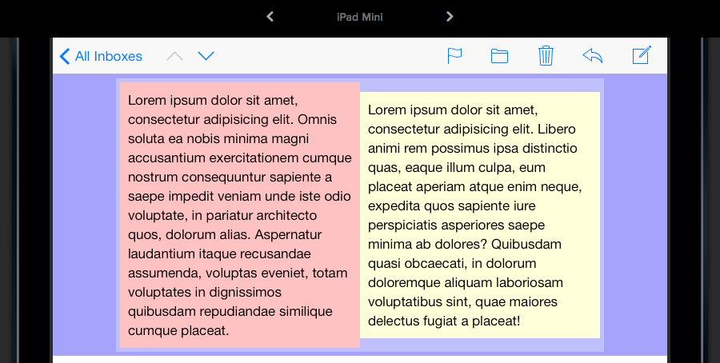
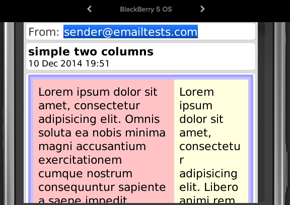
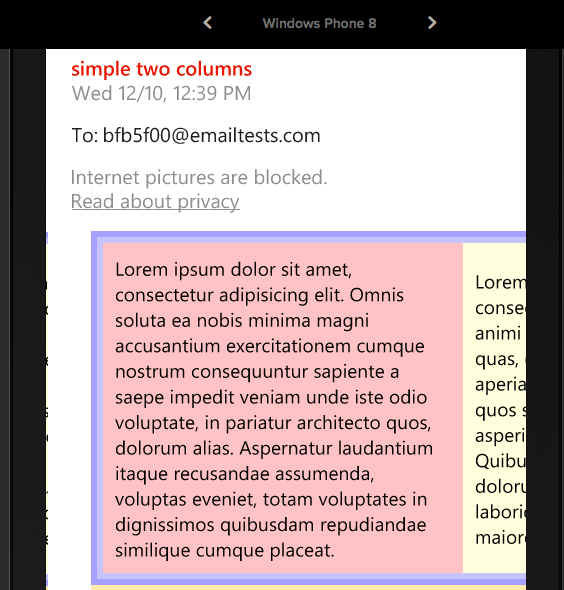
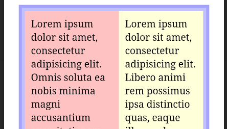
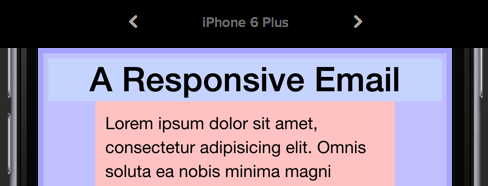
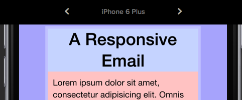

# Responsive email template.
## The objective
Here I will make a responive HTML email template. It will have two columns which condense down to one column on smaller screens.
```
_________________                   _________
| Header        |                   |Header |
|_______________|           |\      |_______|
|Column1|Column2|   --------| \     |Column1|
|       |       |   --------| /     |       |
|       |       |           |/      |       |
|_______|_______|                   |_______|
|Footer         |                   |Column2|
|_______________|                   |       |
                                    |       |
                                    |_______|
                                    |Footer |
                                    |_______|
```

It will work on almost all the email clients I can test with Litmus (https://litmus.com), including all versions of Outlook and Gmail. The only clients causing problems are old versions of Lotus notes, but it will still be readable.

I will also test the email directly in the following clients:

- Web
  - Gmail on Chrome
  - Yahoomail on Chrome
  - Outlook on Chrome
- Desktop
  - Apple Mail
- Mobile
  - Gmail app for Android
  - Android Mail

##The Problem

Writing HTML emails that look good across all devices and email clients is not a trivial task. If you are used to responsive HTML you will be thinking `@media` queries, percentage `width`s, `max-width`s/`min-width`s, `inline-block`s, `float`s... a quick look at some of the limitations of popular email clients will quickly burst this dream.

* Gmail
..* Removes any `<style>` tags. So all styles must be inline!
..* No support for `@media` queries.
..* Converts all `height` attributes to `min-height` and ignores negative margins/padding. So containers will always expand vertically to fit content.
* Outlook for desktop
..* Ignores `display` attribute. No `inline-block` styling.
..* Ignores `float` attribute.
..* Ignores all margins and applies some of its own.
..* Ignores `max-width`.
* Windows phone 8
..* renders in quirks mode by default. But this can be fixed easily: add `<meta http-equiv="X-UA-Compatible" content="IE=edge" />` to the head.

## Existing templates

Looking on the web for something that will do this. I find [Cerberus](http://tedgoas.github.io/Cerberus/)

At first glance, Cerberus appears to be exactly what we want, but on closer inspection we can see that it is not. Their first template does exactly what we want, but only in clients that support media queries, so not gmail. Their second template does work on gmail, but doesn't exhibit the desired behaiour of two columns condensing down to one.

Gmail is a client we simply can't ignore. Litmus [ranks](http://emailclientmarketshare.com/) it as #2 in the world. So I will have to find my own solution.

## A Basic Email

So, lets try a basic, responsive email. No columns or funny business to start.

```html
<!DOCTYPE html PUBLIC "-//W3C//DTD XHTML 1.0 Strict//EN" "http://www.w3.org/TR/xhtml1/DTD/xhtml1-strict.dtd">
<html xmlns="http://www.w3.org/1999/xhtml">
<head>
  <meta http-equiv="Content-Type" content="text/html; charset=utf-8" />
  <meta name="viewport" content="width=device-width, initial-scale=1.0"/>
  <title>Responsive Email</title>
</head>
<body style="margin: 0; padding: 0; width:100%; height:100%;">
  <table class="email_body" width="100%" cellspacing="0" cellpadding="10" border="0" bgcolor="#A6A3FC">
    <tr>
      <td align="center">
        <table class="wrapper" style="max-width:600px;" cellspacing="0" cellpadding="10" border="0" bgcolor="#C0C0FF">
          <tr>
            <td>
              Lorem ipsum dolor sit amet, consectetur adipisicing elit. Facilis fugit possimus sunt reiciendis sequi eligendi pariatur sapiente, expedita amet quaerat et molestiae deserunt? Asperiores assumenda id, voluptatum illo minus rem fuga, delectus cupiditate vitae enim tempore consequuntur ipsam doloremque, recusandae facere ipsum error eum harum minima nisi! Earum modi aspernatur soluta aliquid doloribus minus accusamus animi quis vel. Nihil itaque doloribus ducimus aliquam voluptatibus molestiae adipisci iusto quos quisquam sint quae deserunt quasi ipsum ea praesentium optio tempore eos qui asperiores atque, deleniti nobis laboriosam ut quis? Nihil quas debitis qui dicta illum. Sunt accusantium, repudiandae aperiam culpa praesentium est!
            </td>
          </tr>
        </table>
      </td>
    </tr>
  </table>
</body>
</html>
```

We use the strict XHTML doctype as this is what your email client is likely to be using. The head is what you would expect for a responsive page, although many clients will discard this too.

So we have an `email_body` table, which will fill the available width of the email. It's contents are aligned `center` to center the email in the email window.
And we have a `wrapper` table, set to a max-width of 600px.
Both tables have a `cellpadding` of 10px, and background colours to help us see what is going on.

Lets see what Litmus makes of this.

Firstly we can see that most of the desktop clients are ignoring our max-width


Thunderbird is the only one to get it right.


As for Lotus notes 8...

Well lets just not go there...

Secondly we can see the treatment of the text alignment is inconsistent. Some Clients, such as older versions of outlook, some web based clients running on internet explorer, and Windows Phone are centering the text. Fortunately this is an easy fix, just add `align="left"` to it.
")


On the bright side. All the mobiles and tablets are working pretty much how we would like them too.


##Max-width work around

Some people advocate using `@media` queries for the clients that do support them, to set the width on larger screens. However this causes issues with web-based clients in that the width detected by the media query is the full width of the browser, not the part of it that the email is in.

In Apple Mail, it turns out that it allows `max-width` on block level elements, but not on table elements. So a quick fix is to add the style `display:block` to our table. This also fixes Outlook 2011 on mac, because this version of Outlook, like Apple Mail, uses WebKit, and is therefore farely sensible. (It also turns out that this cures Lotus Notes 8 of it's crazyness as well, although it doesn't fix the `max-width` problem.)

But what about the rest of Outlook and Lotus Notes? Thankfully Microsoft have been very helpful, and given us some conditional code that only they will render. It looks like this:

```
<!--[if (gte mso 9)|(IE)]>
  ...code...
<![endif]-->
```
`mso 9` targets Microsoft Office 2000, `gte` means greater than or equal to. So this should match version 2000 and later. `IE` targets internet explorer versions 5-9.

Turns out `IE` Matches Lotus notes 8 & 8.5, and Outlook 2002 & 2003.
While `gte mso 9` matches outlook 2007, 2010 & 2013.

Note that it does not mach Outlook 2011. Nor would we want it to as it's working fine.

What can we do with this code? Since the clients this matches are always desktop based, we can dispense with the responsiveness and code in the width of the table to 600px. I've given it a nice colour so we can see where it is being used.

```html
<table class="wrapper" style="max-width:620px; display:block" cellspacing="0" cellpadding="10" border="0" bgcolor="#C0C0FF">
  <tr>
    <td align="left">
      <!-- Outlook and Lotus Notes don't support max-width but are always on desktop, so we can enforce a wide, fixed width view. -->
      <!--[if (gte mso 9)|(IE)]>
      <table width="600" cellpadding="0" cellspacing="0" border="0" bgcolor="#FFF3CO">
        <tr>
          <td width="600">
      <![endif]-->

      Lorem ipsum dolor sit amet, consectetur adipisicing elit. Facilis fugit possimus sunt reiciendis sequi eligendi pariatur sapiente, expedita amet quaerat et molestiae deserunt? Asperiores assumenda id, voluptatum illo minus rem fuga, delectus cupiditate vitae enim tempore consequuntur ipsam doloremque, recusandae facere ipsum error eum harum minima nisi! Earum modi aspernatur soluta aliquid doloribus minus accusamus animi quis vel. Nihil itaque doloribus ducimus aliquam voluptatibus molestiae adipisci iusto quos quisquam sint quae deserunt quasi ipsum ea praesentium optio tempore eos qui asperiores atque, deleniti nobis laboriosam ut quis? Nihil quas debitis qui dicta illum. Sunt accusantium, repudiandae aperiam culpa praesentium est!
    
      <!-- End of Outlook-specific wrapper -->
      <!--[if (gte mso 9)|(IE)]>
          </td>
        </tr>
      </table>
      <![endif]-->
    </td>
  </tr>
</table>
```

This fixes Lotus Noes 8 - 8.5, and all the Outlooks.


It has no effect on any clients we don't want it to.

(So we haven't fixed Lotus Notes 6.5 or 7. I view them in the same way I view IE6: obsolete and not worth my time, as long as its still possible for them to read the email, I don't care how horrible it looks.)

##Two Columns

What we can't do is give the columns a percentage width (e.g. 50%), because this will lead to them having 50% width on mobiles too (remember media queries are not an option). And so we have to give them a fixed width.

What is a good width for a column to be displayed full width on mobile?

Well, we need to see how different devices behave. Some experimentation with Litmus uncovers the following:
- All iPhones will scale down emails which are too big, so there is a little flexability. Width ranges from 320px to 414px. We don't want too much scaling as this will make text small and hard to read.
- Blackberry (447px) and the Gmail App for Android will reduce the width of any elements which are too big (essentially applying `max-width` to everything), again this allows for some leeway, although can cause issues.

However others aren't flexible at all
- Android 4.2 (320px)
- Windows Phone (is 384px wide, but scales everything up by 20%, so we actually need to design for 320px)

Seems like 320 is a good overall size. If we give 10px to the email's margins, then we can have columns of 300px, nicely fitting into our 600px container.

Responsive web designers have two main tricks for getting content to move underneith each other: `display:inline-block` and `float:left`. Inline-block has one advantage over float as it doesn't interfere with the nice centering of our column. 

```html
<table cellspacing="0" cellpadding="10" border="0">
  <tr align="center">
    <td align="left" width="280px" style="background-color: #FFC2C2; display:inline-block">
      Lorem ipsum dolor sit amet, consectetur adipisicing elit. Omnis soluta ea nobis minima magni accusantium exercitationem cumque nostrum consequuntur sapiente a saepe impedit veniam unde iste odio voluptate, in pariatur architecto quos, dolorum alias. Aspernatur laudantium itaque recusandae assumenda, voluptas eveniet, totam voluptates in dignissimos quibusdam repudiandae similique cumque placeat.
    </td><!--
   --><td align="left" width="280px" style="background-color: #FFFFDA; display:inline-block">
      Lorem ipsum dolor sit amet, consectetur adipisicing elit. Libero animi rem possimus ipsa distinctio quas, eaque illum culpa, eum placeat aperiam atque enim neque, expedita quos sapiente iure perspiciatis asperiores saepe minima ab dolores? Quibusdam quasi obcaecati, in dolorum doloremque aliquam laboriosam voluptatibus sint, quae maiores delectus fugiat a placeat!
    </td>
  </tr>
</table>
```
For Float, replace `display:inline-block` with `float:left`.

_Tip: when using `inline-block`, don't leave any whitespace (spaces, tabs, line breaks) between the elements, or it will render as a space._

Both of these techniques have similar results. It looks suprisingly good across the board.



We are only let down by blackberry and Windows Phone 8.


I also found that the android mail app on my phone didn't render correctly, and showed two very narrow columns.


It seems that setting `float` or `inline-block` on a `td` is not always supported.

What if we set it on a `table` instead?
```html
  <table width="300px" cellspacing="0" cellpadding="10" border="0" bgcolor="#FFC2C2" style="display:inline-block">
    <tr>
      <td align="left">
        Lorem ipsum dolor sit amet, consectetur adipisicing elit. Omnis soluta ea nobis minima magni accusantium exercitationem cumque nostrum consequuntur sapiente a saepe impedit veniam unde iste odio voluptate, in pariatur architecto quos, dolorum alias. Aspernatur laudantium itaque recusandae assumenda, voluptas eveniet, totam voluptates in dignissimos quibusdam repudiandae similique cumque placeat.
      </td>
    </tr>
  </table><!--
 --><table width="300px" cellspacing="0" cellpadding="10" border="0" bgcolor="#FFFFDA" style="display:inline-block">
    <tr>
      <td align="left">
        Lorem ipsum dolor sit amet, consectetur adipisicing elit. Libero animi rem possimus ipsa distinctio quas, eaque illum culpa, eum placeat aperiam atque enim neque, expedita quos sapiente iure perspiciatis asperiores saepe minima ab dolores? Quibusdam quasi obcaecati, in dolorum doloremque aliquam laboriosam voluptatibus sint, quae maiores delectus fugiat a placeat!
      </td>
    </tr>
  </table>
```
Yes. Blackberry and my Android mail app are now working. Windows Phone 8 is still having problems, but I realise I've forgotton to add the piece of code that will get it out of quirks mode.

```html
<meta http-equiv="X-UA-Compatible" content="IE=edge" />
```
That fixes it.

Now Outlook and Lotus Notes are broken because they don't support the `display` property. This may seem like a step backwards, but remember we have that magical piece of code that can fix Outlook and Lotus Notes.

```html
<table class="wrapper" style="max-width:610px; display:block" cellspacing="0" cellpadding="5" border="0" bgcolor="#C0C0FF">
  <tr>
    <td align="center">
      <!-- Outlook and Lotus Notes don't support max-width but are always on desktop, so we can enforce a wide, fixed width view. -->
      <!--[if (gte mso 9)|(IE)]>
      <table width="600" cellpadding="0" cellspacing="0" border="0" bgcolor="#FFF3C0">
        <tr>
          <td width="300">
      <![endif]-->

      <table width="300px" cellspacing="0" cellpadding="10" border="0" bgcolor="#FFC2C2" style="display:inline-block">
        <tr>
          <td align="left">
            Lorem ipsum dolor sit amet, consectetur adipisicing elit. Omnis soluta ea nobis minima magni accusantium exercitationem cumque nostrum consequuntur sapiente a saepe impedit veniam unde iste odio voluptate, in pariatur architecto quos, dolorum alias. Aspernatur laudantium itaque recusandae assumenda, voluptas eveniet, totam voluptates in dignissimos quibusdam repudiandae similique cumque placeat.
          </td>
        </tr>
      </table><!--[if (gte mso 9)|(IE)]>
          </td>
          <td width="300">
<![endif]--><table width="300px" cellspacing="0" cellpadding="10" border="0" bgcolor="#FFFFDA" style="display:inline-block">
        <tr>
          <td align="left">
            Lorem ipsum dolor sit amet, consectetur adipisicing elit. Libero animi rem possimus ipsa distinctio quas, eaque illum culpa, eum placeat aperiam atque enim neque, expedita quos sapiente iure perspiciatis asperiores saepe minima ab dolores? Quibusdam quasi obcaecati, in dolorum doloremque aliquam laboriosam voluptatibus sint, quae maiores delectus fugiat a placeat!
          </td>
        </tr>
      </table>
      <!-- End of Outlook-specific wrapper -->
      <!--[if (gte mso 9)|(IE)]>
          </td>
        </tr>
      </table>
      <![endif]-->
    </td>
  </tr>
</table>
```

And there, my dear friends, you have a responsive email. 

##Finishing Touches

Now I did say the email would have a header and footer. So I'll add some in. This reqires adding a few more nested tables. I've also fixed the alignment of the columns to the top.

```html
<table class="wrapper" style="max-width:610px; display:block" cellspacing="0" cellpadding="5" border="0" bgcolor="#C0C0FF">
  <tr>
    <td>
      <!-- Outlook and Lotus Notes don't support max-width but are always on desktop, so we can enforce a wide, fixed width view. -->
      <!--[if (gte mso 9)|(IE)]>
      <table width="600" cellpadding="0" cellspacing="0" border="0">
        <tr>
          <td width="600">
      <![endif]-->

      <table cellspacing="0" cellpadding="0" border="0" >
        <tr>
          <td align="center" width="100%" style="font-size:2em; background-color: #C5D3FF">
            <center>
              <b>A Responsive Email</b>
            </center>
          </td>
        </tr>
        <tr align="center">
          <td>
            <!--[if (gte mso 9)|(IE)]>
            <table width="600" cellpadding="0" cellspacing="0" border="0">
              <tr>
                <td width="300" valign="top">
            <![endif]-->
            
            <table valign="top" width="300px" cellspacing="0" cellpadding="10" border="0" bgcolor="#FFC2C2" style="display:inline-block; vertical-align: top">
              <tr>
                <td align="left">
                  Lorem ipsum dolor sit amet, consectetur adipisicing elit. Omnis soluta ea nobis minima magni accusantium exercitationem cumque nostrum consequuntur sapiente a saepe impedit veniam unde iste odio voluptate, in pariatur architecto quos, dolorum alias. Aspernatur laudantium itaque recusandae assumenda, voluptas eveniet, totam voluptates in dignissimos quibusdam repudiandae similique cumque placeat.
                </td>
              </tr>
            </table><!--[if (gte mso 9)|(IE)]>
                </td>
                <td width="300" valign="top">
      <![endif]--><table valign="top" width="300px" cellspacing="0" cellpadding="10" border="0" bgcolor="#FFFFDA" style="display:inline-block; vertical-align: top">
              <tr>
                <td align="left">
                  Lorem ipsum dolor sit amet, consectetur adipisicing elit. Libero animi rem possimus ipsa distinctio quas, eaque illum culpa, eum placeat aperiam atque enim neque, expedita quos sapiente iure perspiciatis asperiores saepe minima ab dolores? Quibusdam quasi obcaecati, in dolorum doloremque aliquam laboriosam voluptatibus sint, quae maiores delectus fugiat a placeat!
                </td>
              </tr>
            </table>
            <!--[if (gte mso 9)|(IE)]>
                </td>
              </tr>
            </table>
            <![endif]-->

          </td>
        </tr>
        <tr>
          <td align="left" width="100%" style="background-color: #C5D3FF">
            By Jen Berry
          </td>
        </tr>
      </table>

      <!-- End of Outlook-specific wrapper -->
      <!--[if (gte mso 9)|(IE)]>
          </td>
        </tr>
      </table>
      <![endif]-->
    </td>
  </tr>
</table>
```

This works nicely in most cases.


However it can look a bit strange at intermediate sizes in between 320px and 600px


For devices that support it, we can use a media query to force the width to 320px
```css
@media only screen and (max-width: 620px) {
    .wrapper {
      width: 310px !important;
    }
  }
```
This fixes mobile devices (except blackberry)


but doesn't help with the web based browsers because the width of the email is much less than the width of the browser that the media query uses.
")

There's no way around this I have found, except to factor it in to your designs. Maybe you would rather the columns didn't center, but displayed on the left, so it looks better, or restrict the width of your header and footer to the width of your columns. But how often are web-based email clients viewed at less than 620px? Maybe this is something we can ignore.